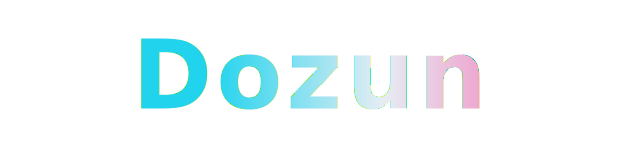
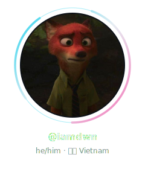
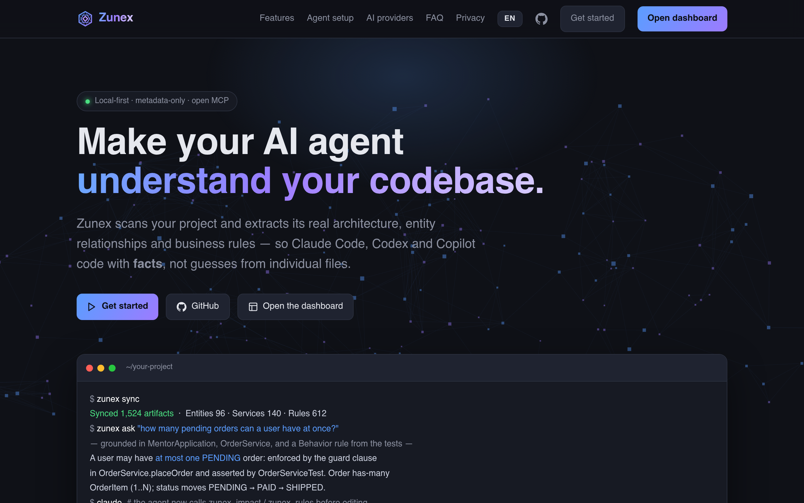
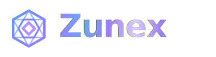

  

<h3 align="center">
  
</h3>

### About me

  
  &nbsp;&nbsp;
  

### Tech Stack

<b>Languages</b> &nbsp;&nbsp;

<b>Databases</b> &nbsp;&nbsp;

<b>Tools</b> &nbsp;&nbsp;&nbsp;&nbsp;&nbsp;&nbsp;&nbsp;&nbsp;&nbsp;&nbsp;

### Projects & Live Sites

Local-first code knowledge engine that helps AI agents understand a codebase through metadata, a knowledge graph & impact analysis. Supports **C# · Spring · Node · NestJS · Laravel** + MCP.

 

### GitHub Stats

  
  

  

  

### Contributions

<picture>
  <source media="(prefers-color-scheme: dark)" srcset="https://raw.githubusercontent.com/iamdwn/iamdwn/output/github-snake-dark.svg" />
  <source media="(prefers-color-scheme: light)" srcset="https://raw.githubusercontent.com/iamdwn/iamdwn/output/github-snake.svg" />
  
</picture>

 

  

