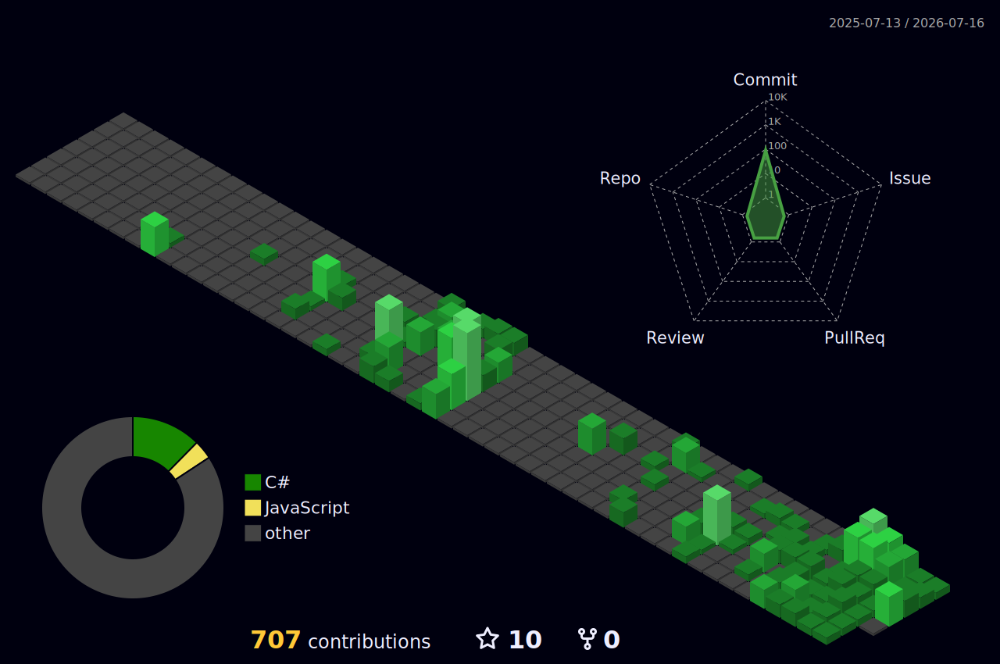

<p align="center">
  
</p>

<h3 align="center">
  
</h3>


###  About me

<table>
  <tr>
    <td width="160" align="center">
      
    </td>
    <td>

```yaml
name:       Dozun
age:        22
role:       Back-end Developer
location:   Vietnam 🇻🇳
education:  FPT University
motto:      "No applause, only silent momentum."
```

   </td>
  </tr>
</table>


###  Tech Stack

<div align="center">
  
</div>

<div align="center">
  
  
</div>


###  GitHub Stats

<div align="center">
  
  
</div>

<div align="center">
  
</div>

<div align="center">
  
</div>

<div align="center">
  
</div>


###  Contribution in 3D

<div align="center">
  
</div>

<picture>
  <source media="(prefers-color-scheme: dark)" srcset="https://raw.githubusercontent.com/iamdwn/iamdwn/output/github-snake-dark.svg" />
  <source media="(prefers-color-scheme: light)" srcset="https://raw.githubusercontent.com/iamdwn/iamdwn/output/github-snake.svg" />
  
</picture>


<br />

<div align="center">
  <a href="https://iamdwn.github.io/iamdwn">
    
  </a>
</div>


