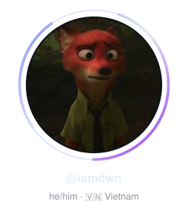
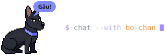

  

<h3 align="center">
  
</h3>

  
  
  

### About me

  
  &nbsp;&nbsp;
  

### Projects & Live Sites

  

  

### GitHub Stats

<!-- 

  
  

 -->

  

  

### Contributions

<picture>
  <source media="(prefers-color-scheme: dark)" srcset="https://raw.githubusercontent.com/iamdwn/iamdwn/output/github-snake-dark.svg" />
  <source media="(prefers-color-scheme: light)" srcset="https://raw.githubusercontent.com/iamdwn/iamdwn/output/github-snake.svg" />
  
</picture>

 

  

