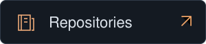
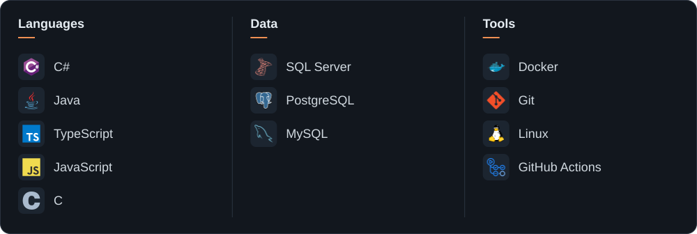
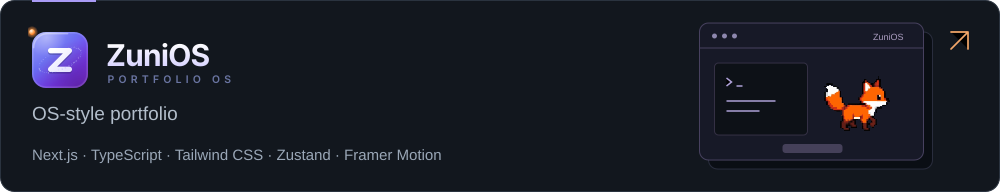
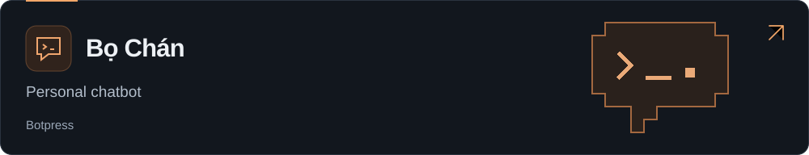
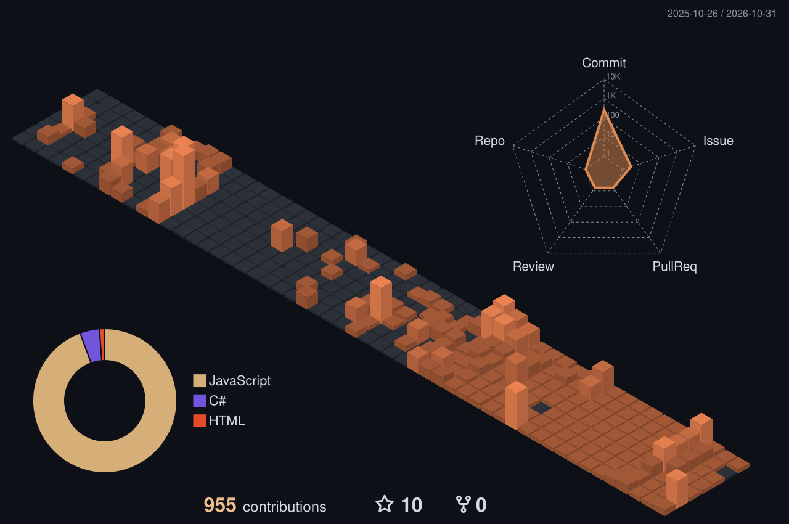

<picture>
  <source media="(max-width: 640px)" srcset="./assets/fox-header-mobile.svg" />
  
</picture>

  
  
  

### Stack

<picture>
  <source media="(max-width: 640px)" srcset="./assets/stack-mobile.svg" />
  
</picture>

### Projects

<a href="https://zunios.iamdwn.dev/">
  <picture>
    <source media="(max-width: 640px)" srcset="./assets/project-zunios-mobile.svg" />
    
  </picture>
</a>

 

<a href="https://iamdwn.github.io/iamdwn/">
  <picture>
    <source media="(max-width: 640px)" srcset="./assets/project-chat-mobile.svg" />
    
  </picture>
</a>

### GitHub Stats

  

### GitHub activity

<picture>
  <source media="(prefers-color-scheme: dark)" srcset="https://raw.githubusercontent.com/iamdwn/iamdwn/output/github-snake-dark.svg" />
  <source media="(prefers-color-scheme: light)" srcset="https://raw.githubusercontent.com/iamdwn/iamdwn/output/github-snake.svg" />
  
</picture>
